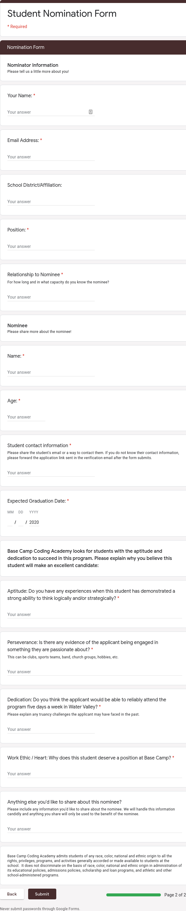

# Java Benchmark - BCCA Nomination

For this benchmark you are building software to automate processing BCCA student nominations. For a high school student to become a BCCA student, they must first be nominated by using the form pictured below.

This form allows BCCA to collect and process nominations for students. Your job is to turn this form into a terminal application. Instead of filling out this web form, BCCA wants to put a computer in high school teacher's lounges with a program that allows teachers to fill out a nomination. Reference the form pictured above to determine what data is necessary from the user.

## Requirements

A teacher should be able to nominate a student in a similar format to the form pictured above.

Your code should be readable.

Your applications should be usable.

## Levels of Success

- **Needs Improvement**
  - Teachers can nominate a student, but the data isn't stored between program executions.
- **Meets Expectations**
  - Teachers can nominate a student, and the data is stored between program executions.
- **Exceeds Expectations**
  - A separate application is developed for BCCA employees:
    - BCCA employees can view placed nominations.
    - BCCA employees can mark a nomination as approved or denied.

## Submission

Email Sean, Nate, and Fernae a link to the Github repository containing your solution.
